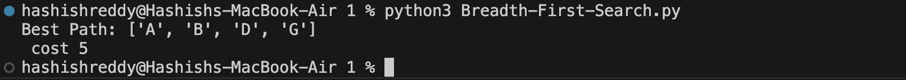
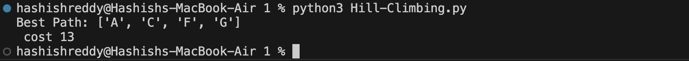

# Graph Search Algorithms

This repository implements various search algorithms on a given graph, starting from node `A` and ending at node `G`. Each algorithm finds the best path from `A` to `G` based on different strategies. The graph and heuristic values are hard-coded, but you can modify them as needed.

## Graph Structure

The graph used in all algorithms:

```
graph = {
    'A': {'B': 2, 'C': 3},
    'B': {'A': 2, 'D': 1, 'E': 5},
    'C': {'A': 3, 'F': 4},
    'D': {'B': 1, 'G': 2},
    'E': {'B': 5, 'G': 3},
    'F': {'C': 4, 'G': 6},
    'G': {'D': 2, 'E': 3, 'F': 6}
}
```

The heuristic values for each node:

```
heuristic = {
    'A': 7,
    'B': 6,
    'C': 5,
    'D': 4,
    'E': 3,
    'F': 2,
    'G': 0
}
```

## Algorithms and Expected Outputs

### 1. **British Museum Search**
- **Description:** This is a brute-force approach where all possible paths are explored.
- **Output:**
  

### 2. **Depth-First Search (DFS)**
- **Description:** DFS explores each branch of the graph as deeply as possible before backtracking.
- **Output:**
  

### 3. **Breadth-First Search (BFS)**
- **Description:** BFS explores all the nodes at the present depth level before moving on to nodes at the next depth level.
- **Output:**
  

### 4. **Hill Climbing**
- **Description:** A greedy algorithm that always expands the node with the lowest heuristic value.
- **Output:**
  

### 5. **Beam Search**
- **Description:** Beam Search keeps track of a limited number of best nodes at each level to reduce memory usage.
- **Output:**
  

### 6. **Oracle Search**
- **Description:** Hypothetical search with perfect knowledge about the shortest path.
- **Output:**
  

### 7. **Branch and Bound (B&B)**
- **Description:** B&B explores all possible paths but prunes paths with a higher cost than the best path found so far.
- **Output:**
  

### 8. **Branch and Bound Greedy**
- **Description:** B&B Greedy uses a heuristic to guide the search while also pruning paths.
- **Output:**
  

### 9. **Branch and Bound Greedy with Exit**
- **Description:** This variation of B&B Greedy exits immediately when the goal node is found.
- **Output:**
  

### 10. **Branch and Bound Greedy + Heuristic**
- **Description:** Combines both cost and heuristic aggressively to prune the search space.
- **Output:**
  

### 11. **Branch and Bound with Heuristic**
- **Description:** Combines the B&B approach with heuristics, exploring nodes based on both cost and heuristic.
- **Output:**
  

### 12. **A* Algorithm**
- **Description:** A* is an informed search algorithm that uses both path cost and heuristics to find the optimal path.
- **Output:**
  
